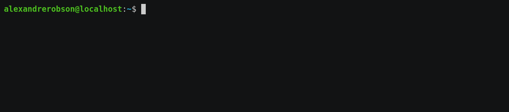

# ProgressBar v1.2

## Sobre
Shell script que exibe a execução de um script principal ou uma lista de comandos em uma barra de progresso atualizando-a com mensagens definidas e seu percentual do total

## Modo de Uso
Basicamente a sintaxe de uso da progressbar é ao longo do script atualizar o progresso através de:

`setprogress [int parcial(%)] [str Mensagem exibida]`



1. Chamando de dentro do script principal (main)

```
#!/bin/bash
source progressbar


comando
setprogress 8 Executando Comando 1
comando 1
setprogress 12 "Verificando dependências (Comando 2)"
comando 2
setprogress 23 Atualizando Comando 3
comando 3
setprogress 37 Executando Comandos 4,5,etc...
comando 4
setprogress 49
comando 5
setprogress 66
comando ...
setprogress 72 Removendo arquivos temporários
comando 8
setprogress 86 Finalizando o script principal
comando n
```

2. Chamando a progressbar e passando o script como parâmetro

`progressbar exemplo/script`

3. Chamando a progressbar e passando como parâmetro, uma lista de comandos

`bash progressbar 'comando; setprogress 8 Executando Comando 1; comando 1; setprogress 86 Finalizando...; comando n'`

## Função progressBar

A função __progressbar()__ utiliza tput e printf para criar uma barra de progresso preenchendo toda a largura do terminal que executa e roda com os seguintes parâmetros:

`progressbar <int partial> [[int total] str mensagem]`

Caso as variáveis **total** e **mensagem** estejam indefinidas, assumem os valores **total=100** e **msg=Progress**